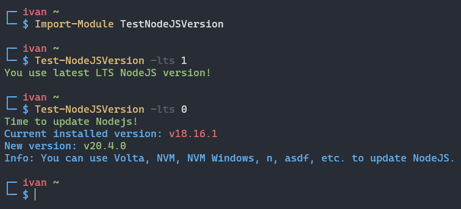

# TestNodeJSVersion-PS



Tiny PowerShell module for check for new NodeJS versions.

## Installing

```powershell
Install-Module TestNodeJSVersion -Scope CurrentUser -AllowClobber
```

## Usage

> Don't forget to import module =)
>
> ```powershell
> Import-Module TestNodeJSVersion
> ```

### `Test-NodeJSVersion`

```
NAME
    Test-NodeJSVersion

SYNOPSIS
    Checks new NodeJS versions.


SYNTAX
    Test-NodeJSVersion [[-CheckOnlyLTS] <Boolean>] [<CommonParameters>]


DESCRIPTION


PARAMETERS
    -CheckOnlyLTS <Boolean>
        Check only LTS or all versions.

        Required?                    false
        Position?                    1
        Default value                True
        Accept pipeline input?       false
        Accept wildcard characters?  false

    <CommonParameters>
        This cmdlet supports the common parameters: Verbose, Debug,
        ErrorAction, ErrorVariable, WarningAction, WarningVariable,
        OutBuffer, PipelineVariable, and OutVariable. For more information, see
        about_CommonParameters (https://go.microsoft.com/fwlink/?LinkID=113216).

INPUTS

OUTPUTS

    -------------------------- EXAMPLE 1 --------------------------

    PS > Test-NodeJSVersion -lts 1 # Checks only LTS


    -------------------------- EXAMPLE 2 --------------------------

    PS > Test-NodeJSVersion -lts 0 # Checks all versions


RELATED LINKS

```
